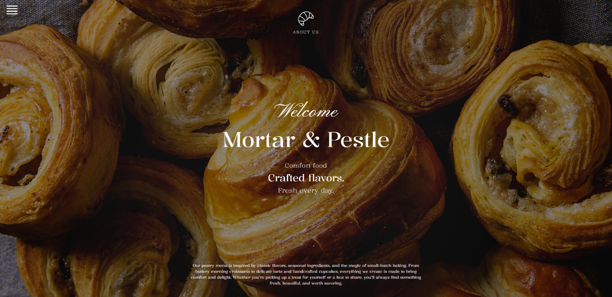
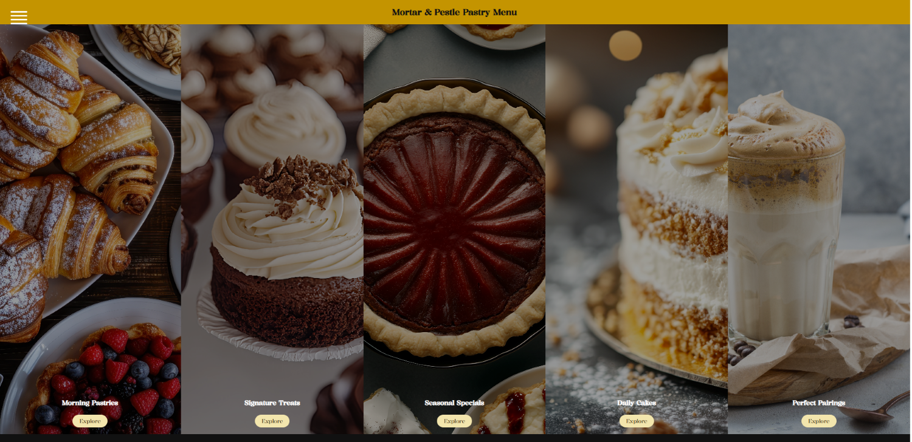
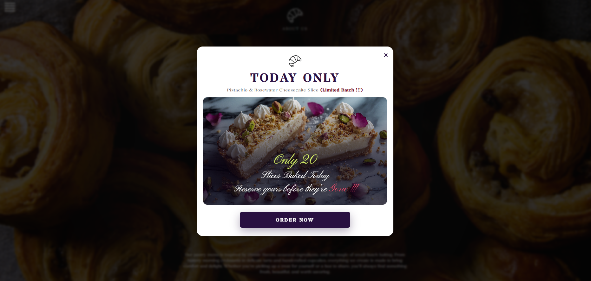

# Mortal-PestleBakery
Mortar &amp; Pestle Bakery is a responsive bakery website designed to showcase artisan baked goods, seasonal specials, and beverages. The site allows customers to browse menu items, view daily specials, place pickup orders, and learn more about the bakery through an intuitive and user-friendly interface.

## Overview
Responsive bakery website designed to showcase artisan baked goods, beverages, and seasonal specials.

## Features
- Responsive Design
- Interactive Menu
- Daily Specials
- Pickup Ordering
- Bakery Information
- JavaScript Animations

## Technologies
- HTML5
- CSS3
- JavaScript

## Screenshots

### Homepage

### Menu

### Daily Specials

